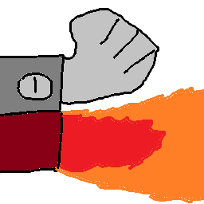

<div align="center">

  

  # ggst-clipper

  <p align="center">
    <strong>対戦格闘ゲームの動画から、試合シーンを画像認識で自動検出＆高精度クリッピング</strong>
    <br />
    <i>Automated Match Clip Generator for Fighting Game Footage via Template Matching</i>
  </p>

  <p align="center">
    <a href="https://github.com/2shi0/ggst-cliper/releases"></a>
    <a href="https://github.com/2shi0/ggst-cliper/actions/workflows/release.yml"></a>
    <a href="http://www.wtfpl.net/"></a>
  </p>

  <p align="center">
    <a href="https://github.com/2shi0/ggst-cliper/stargazers"></a>
    <a href="https://github.com/2shi0/ggst-cliper/releases"></a>
  </p>

</div>

---

## 📖 Overview / 概要

**ggst-clipper** は、対戦格闘ゲーム（GUILTY GEAR -STRIVE- など）の長時間録画アーカイブから、画像認識を用いて試合開始・終了・勝敗シーンを自動検出し、試合単位でスマートに切り抜いて保存する Windows 向け GUI ツールです。

「配信アーカイブから自分の試合だけを後で振り返りたい」「対戦ごとに動画を分割・整理したい」といった作業を全自動化します。

---

## 📋 Prerequisites / 必要環境

- **OS**: Windows 10 / 11 (64-bit)
- **FFmpeg**: 動画の解析および切り抜き処理に必須です。

未インストールの場合は、PowerShell 等で以下のコマンドを実行してインストールしてください。

```powershell
winget install ffmpeg
```

> [!NOTE]
> インストール後、ターミナルで `ffmpeg -version` が実行可能であることを確認してください。

---

## 📥 Installation / インストール

### 方法 1: インストーラーを使用（推奨）
1. [Releases ページ](https://github.com/2shi0/ggst-cliper/releases) から最新バージョンのインストーラー（`ggst-clipper-setup-*.exe`）をダウンロードします。
2. インストーラーを実行して画面の指示に従いセットアップを完了します。

### 方法 2: ソースコードからビルド
```powershell
# リポジトリのクローン
git clone https://github.com/2shi0/ggst-cliper.git
cd ggst-cliper

# リリースビルドの実行
cargo build --release
```
ビルド完了後、`target/release/ggst-clipper.exe` が生成されます。

---

## 🚀 Quick Start / 使い方

### 1. 初期設定（Settings）

アプリを起動後、**「Settings」** ボタンをクリックして設定画面を開きます。

```
┌──────────────────────────────────────────────────────────┐
│ Settings                                                 │
├──────────────────────────────────────────────────────────┤
│  [Start Template]     [End Template]                     │
│                                                          │
│  [x] Detect Win/Lose (GGST only)                         │
│  [x] Detect Character Names (GGST only)                  │
│                                                          │
│  Output Directory : [ Browse... ]                        │
│  Threshold        : 0.90                                 │
│  Step Frames      : 60                                   │
│  Start Offset     : 0        End Offset: 0               │
└──────────────────────────────────────────────────────────┘
```

#### ① テンプレート画像の登録
切り抜きの基準となるスクリーンショット画像（PNG / JPG）を用意・登録します。

- **Start Template**: 試合開始時の画像（例: `DUEL 1`, `ROUND 1`）
- **End Template**: 試合終了時の画像（例: `SLASH`, `K.O.`）
- **Detect Win/Lose (GGST only)**（トグル）: リザルト画面の「WIN」「LOSE」テキストをOCRで自動検出し、勝敗を判定します（テンプレート画像の登録は不要です）
- **Detect Character Names (GGST only)**（トグル）: 画面上のキャラ名をOCRで検出し、対戦キャラ別のフォルダに自動分類します

> **画像登録手順**:
> 各項目の枠（`⚠ Select Image`）をクリックして画像を選択します。

#### ② 判定領域の指定（Select Area）
画像全体ではなく、特定のUIや文字部分のみを判定対象にすることで認識精度と速度が大幅に向上します。

1. 登録した画像の右上にある **「Select Area」** ボタンをクリック。
2. 表示された画像上で、判定対象にしたい領域（文字やアイコンなど）をドラッグして囲みます。
3. 下部の **「Confirm」** をクリックして確定します。

#### ③ パラメータ・出力先の設定
| 項目 | 説明 | 推奨値 |
| :--- | :--- | :--- |
| **Output Directory** | 切り抜いた動画の保存先フォルダ（未指定時は元動画フォルダ内の `output/`） | 任意 |
| **Threshold** | 画像一致判定のしきい値（0.0 〜 1.0）。値が小さいほど厳密に判定 | `0.90` |
| **Step Frames** | シーン探索時にスキップするフレーム間隔 | `60` |
| **Start / End Offset** | 切り出し開始・終了地点のフレーム補正値（前後に余白を入れたい場合） | `0` |

---

### 2. 動画の切り抜き（Select Video）

1. メイン画面の **「Select Video」** ボタンをクリックします。
2. 対象の動画ファイル（`.mp4`, `.mkv`, `.avi`, `.mov` 等）を選択します。
3. 解析・切り抜きウィンドウが表示され、自動的にシーン検出とクリップの書き出しが開始されます。
4. 処理完了後、設定した保存先フォルダに試合ごとの切り抜き動画が保存されます。

---

## 🛠️ Tech Stack / 技術構成

- **Language**: [Rust](https://www.rust-lang.org/) (2024 Edition)
- **GUI Framework**: [egui](https://github.com/emilk/egui) / [eframe](https://github.com/emilk/egui/tree/master/crates/eframe)
- **Image Processing**: [image-rs](https://github.com/image-rs/image)
- **Video Processing**: [FFmpeg](https://ffmpeg.org/)
- **Installer**: [Inno Setup](https://jrsoftware.org/isinfo.php)

---

## 📄 License / ライセンス

このプロジェクトは **[WTFPL](http://www.wtfpl.net/)** のもとで公開されています。

```text
            DO WHAT THE FUCK YOU WANT TO PUBLIC LICENSE
                    Version 2, December 2004

 Copyright (C) 2024 2shi0

 Everyone is permitted to copy and distribute verbatim or modified
 copies of this license document, and changing it is allowed as long
 as the name is changed.

            DO WHAT THE FUCK YOU WANT TO PUBLIC LICENSE
   TERMS AND CONDITIONS FOR COPYING, DISTRIBUTION AND MODIFICATION

  0. You just DO WHAT THE FUCK YOU WANT TO.
```

---

<div align="center">
  <sub>Built with ❤️ and 🦀 by <a href="https://github.com/2shi0">2shi0</a></sub>
</div>
